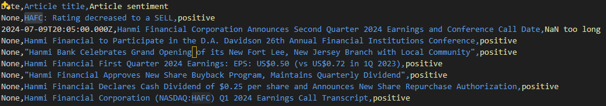

# Ai-Sentiment-Analysis

## Project Overview

This project is designed to streamline the process of identifying undervalued stocks and analyzing their sentiment using Python. By leveraging the `finvizfinance` library for stock screening and the FinBERT pre-trained NLP model for sentiment analysis, the project provides a comprehensive tool for value investors. The project automates the following tasks:

1. **Stock Screening**: Uses the `finvizfinance` library to filter and identify undervalued stocks based on specific financial criteria such as positive operating margin, low debt-to-equity ratio, low P/B ratio, low P/E ratio, low PEG ratio, and positive insider transactions.

2. **Sentiment Analysis**: Utilizes the FinBERT model to analyze the sentiment of recent news articles related to the identified stocks. This helps in understanding the market sentiment and media perspective towards these stocks.

3. **Data Output**: Generates CSV files containing the overview of undervalued stocks and sentiment analysis results for each stock, providing a comprehensive dataset for further manual analysis and decision-making.

The purpose of this project is to aid value investors in quickly identifying potential investment opportunities and gaining insights into the market sentiment surrounding these stocks, thereby facilitating informed investment decisions.

### Criteria for Identifying Undervalued Stocks

The objective is to pinpoint stocks that exhibit the following traits, indicating potential undervaluation and lower investment risk:

1. **Low Price-to-Book (P/B) Ratio**: This ratio suggests the stock is trading for less than the value of the company's assets, hinting at undervaluation, provided the company is not experiencing financial difficulties.
2. **Positive Operating Margin**: A positive margin indicates effective management and efficient profit generation from sales.
3. **Debt-to-Equity Ratio Below 1**: A lower ratio points to companies with reduced financial risk.
4. **Low Price-to-Earnings (P/E) Ratio**: A low P/E ratio, especially compared to its historical average, suggests the stock may be undervalued.
5. **Low Price-to-Earnings Growth (PEG) Ratio**: This ratio helps identify undervalued stocks by considering both price and earnings growth.
6. **Positive Insider Transactions**: Insider purchases of company shares typically signal confidence in the company's future prospects, as insiders have in-depth knowledge of the company's outlook.

### Analyzing Media Sentiment on Undervalued Stocks

With a list of “undervalued” stocks in hand, it's essential to understand the media sentiment surrounding these companies. While a prudent value investor avoids blindly following market trends, having insight into the media's perspective can help determine why a stock might be undervalued or overvalued.

To facilitate this, I've leverage a pre-trained BERT model, specifically FinBERT, to analyze recent news articles related to each stock identified by the stock screener. This program will:

1. Retrieve recent news articles for each stock.
2. Extract and display the headlines and publishing dates of these articles.
3. Analyze and summarize the overall sentiment conveyed in each article.

By using this approach, you can easily gain an overview of the general sentiment towards a stock, helping you make more informed investment decisions.

## For example, based on the stocks selected, it seems like the media agrees that for example HAFC is also an undervalued stock.

